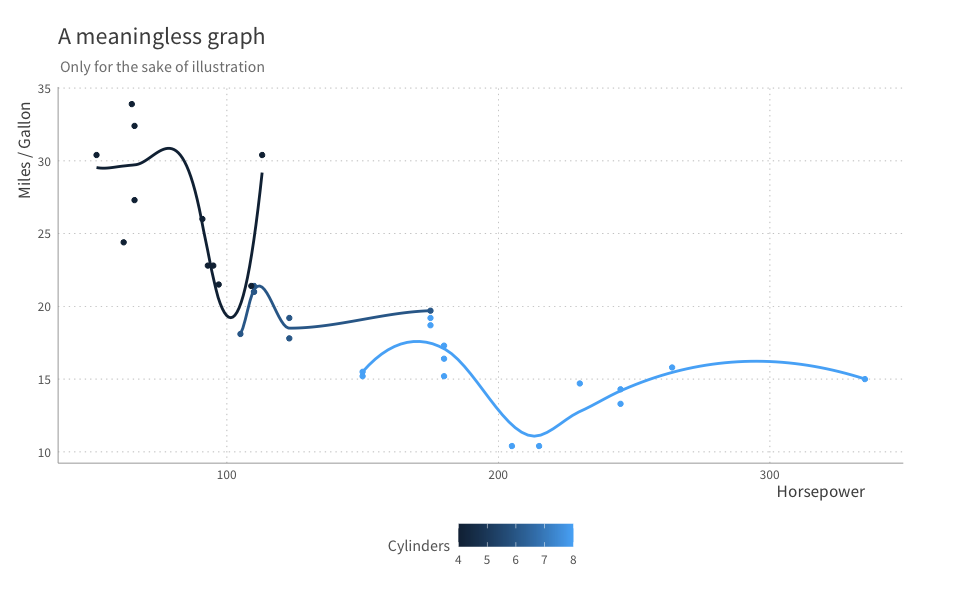
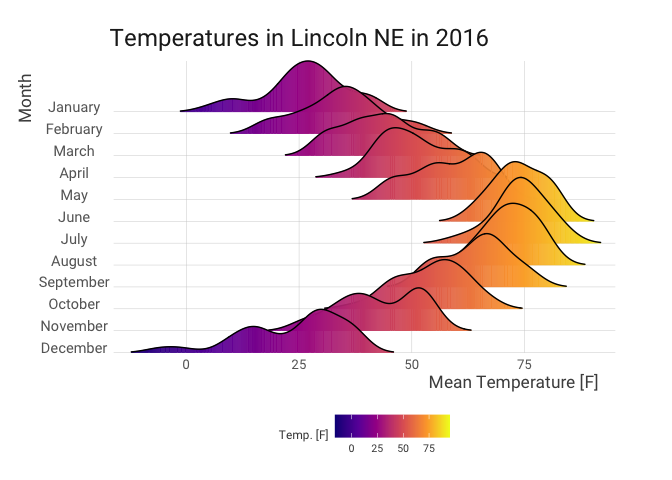

<!-- README.md is generated from README.Rmd. Please edit that file -->

# zibas

<!-- badges: start -->
<!-- badges: end -->

The goal of `zibas` is to make it easy to consistently create beautiful
graphs. The inspiration for this package comes from the brilliant book
*Storytelling with Data* by Cole Nussbaumer Knaflic.

## Installation

You can install the development version of zibas from
[GitHub](https://github.com/) with:

``` r
# install.packages("devtools")
devtools::install_github("datr-studio/zibas")
```

## Usage

``` r
library(zibas)
library(ggplot2)
```

Using `zibas` is simple: just add `theme_ziba()` to any ggplot.

``` r
ggplot(mtcars, aes(hp, mpg, color = cyl, group = cyl)) +
  geom_point() +
  geom_smooth(se = FALSE) +
  labs(
    x = "Horsepower", y = "Miles / Gallon",
    title = "A meaningless graph",
    subtitle = "Only for the sake of illustration",
    color = "Cylinders"
  ) +
  theme_ziba()
#> `geom_smooth()` using method = 'loess' and formula 'y ~ x'
#> Warning in simpleLoess(y, x, w, span, degree = degree, parametric =
#> parametric, : pseudoinverse used at 104.65
#> Warning in simpleLoess(y, x, w, span, degree = degree, parametric =
#> parametric, : neighborhood radius 18.35
#> Warning in simpleLoess(y, x, w, span, degree = degree, parametric =
#> parametric, : reciprocal condition number 5.5839e-17
#> Warning in simpleLoess(y, x, w, span, degree = degree, parametric =
#> parametric, : There are other near singularities as well. 4270.6
```



### Ridge plots

If however, you want to do a ridge plot, `theme_ziba_ridges()` is
recommended, for subtle shifts in the axis location.

``` r
library(ggridges)
ggplot(lincoln_weather, aes(x = `Mean Temperature [F]`, y = `Month`, fill = stat(x))) +
  geom_density_ridges_gradient(scale = 3, rel_min_height = 0.01) +
  scale_x_continuous(expand = c(0, 0)) +
  scale_y_discrete(expand = c(0, 0)) +
  scale_fill_viridis_c(name = "Temp. [F]", option = "C") +
  coord_cartesian(clip = "off") +
  labs(title = "Temperatures in Lincoln NE in 2016") +
  theme_ziba_ridges()
#> Picking joint bandwidth of 3.37
```



### Other goodies

In addition to the themes, `zibas` also provides a standard set of
colours. Following the recommendations of *Storytelling with data*, a
single blue, red, and two grays are provided, using `zibablue()`,
`zibared()`, `zibagray()`, and `zibadarkgray()`.

A gradient function also exists using `ziba_gradient()`, which can
return n colours in the blue spectrum. This is based on the Brewer
Palette’s blues (`RColorBrewer`), but expands it to an arbitrary number
(whereas the original is capped at 9 shades).

To apply this directly to a ggplot, simply add `scale_fill_ziba_blue()`
or `scale_colour_ziba_blue()` as you would any other colour scale.
